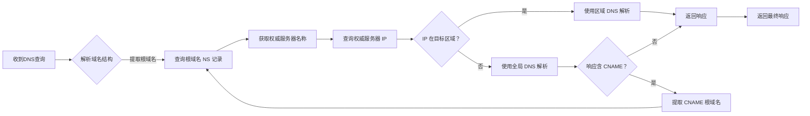

<p align="center">
  
</p>

----------
免列表 DNS 区域分流转发器。
 
> 请确保已经 [安装 .NET SDK](https://learn.microsoft.com/zh-cn/dotnet/core/install/linux) 运行环境
```
git clone https://github.com/mili-tan/ArashiDNS.Nous
cd ArashiDNS.Nous
dotnet run -c Release -g 8.8.8.8:53 -s 223.5.5.5:53 -r CN
```
或者使用 Docker：
```
docker run -d -p 127.0.0.1:6653:6653 -p 127.0.0.1:6653:6653/udp ghcr.io/mili-tan/arashidns.nous -g 8.8.8.8:53 -s 223.5.5.5:53 -r CN -l 0.0.0.0:6653
```
或者从 Releases 下载预编译二进制。

--------

```
ArashiDNS.Nous - 免列表 DNS 区域分流转发器。
Copyright (c) 2025 Milkey Tan. Code released under the FSL-1.1-ALv2 License

Usage: ArashiDNS.Nous [options]

Options:
  -?|-he|--help          显示更多帮助信息。
  -w <TimeOut>           等待回复的超时时间（毫秒）。
  -s <IPEndPoint>        设置目标区域服务器的地址。[223.5.5.5:53]
  -g <IPEndPoint>        设置全局服务器地址。[8.8.8.8:53]
  -r <Region>            设置目标区域。[CN]
  -e <IPAddress>         设置目标区域 ECS 地址。[123.123.123.123]
  -l <ListenerEndPoint>  设置监听地址。[0.0.0.0:6653]
  --log <LogLevel>       设置日志级别。
                         0: 错误, 1: 信息, 2: 调试
  -n|--no-list           不加载 NS 域名列表。
  --mmdb <Path>          设置 GeoLite2-Country.mmdb 的路径。
  --psl <Path>           设置 public_suffix_list.dat 的路径。
```
## How it works?



## License

Copyright (c) 2024 Milkey Tan. Code released under the [FSL-1.1-ALv2 License](https://fsl.software/). 

若需要用于商用生产环境，请购买使用授权。

<sup>ArashiDNS™ is a trademark of Milkey Tan.</sup>
